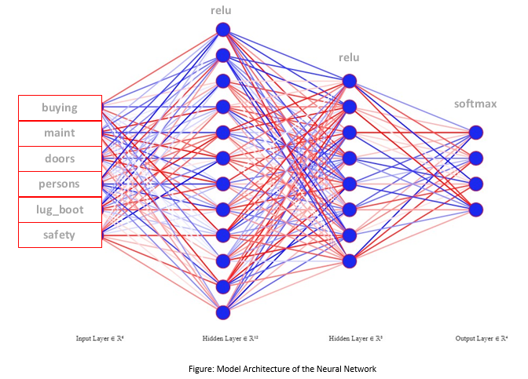
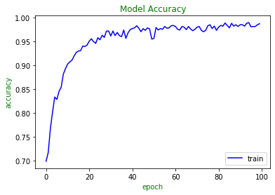
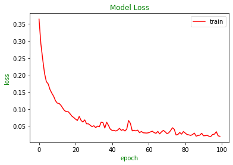

# Car Class Evaluation Using Neural Network

## Dataset Description 
Dataset used in this network can be found here: https://archive.ics.uci.edu/ml/datasets/car+evaluation. The dataset has six input attributes & one output attribute with 1700 instances. Dataset is about different technical characteristics and price of car. Attribute name, type, values are described below:

| Name            | Information                                  | Type               | Values                           |
|-----------------|----------------------------------------------|--------------------|----------------------------------|
|     buying      |     Buying Price                             |     Categorical    |     vhigh, high,   med, low      |
|     maint       |     Price of the maintenance                 |     Categorical    |     vhigh, high,   med, low      |
|     doors       |     Number of Doors                          |     Categorical    |     2, 3, 4, 5more               |
|     persons     |     Capacity in terms of persons to carry    |     Categorical    |     2, 4, more                   |
|     lug_boot    |     Size of luggage boot                     |     Categorical    |     small, med, big              |
|     safety      |     Estimated safety of the car              |     Categorical    |     low, med, high               |
|     class       |     Evaluated class of the car               |     Categorical    |     unacc, acc,   good, vgood    |

## Model Architecture
The model architecture for this network is drawn below:

## Parameter/Hyper Parameter Description
I have used two hidden layers for training the model. For input layer, six attributes are taken as input. For first hidden layer twelve neurons are used and for second hidden layer eight neurons are used. For output layer, four neurons are used as the output attribute has four classes (unacc, acc, good, vgood).
Here, No. of Parameters = No. of Inputs * No. of Neurons + No. of Neurons (Bias)
For first hidden layer No. of Parameters = 6 * 12 + 12 = 84
For second hidden layer No. of Parameters = 12 * 8 + 8 = 104
For output layer No. of Parameters = 8 * 4 + 4 = 36
So, Total trainable Parameters = 84 + 104 + 36 = 224
All the layers are connected densely in this model. For first and second hidden layer “Rectified Linear Unit (RELU)” activation function is used. For the output layer “Softmax” activation function is used. The model is compiled using “Categorical Cross Entropy” loss function and “Adam” optimizer with learning rate 0.01. “Accuracy” is used as performance major metrics. Total 100 Epochs with Batch Size 17 is processed to update the parameters.

## Result
After training the model, accuracy curve and loss curve are generated as below:

After training, 
For test parameters, loss = 7%, accuracy = 97%
For train parameters, loss = 3%, accuracy = 98%
