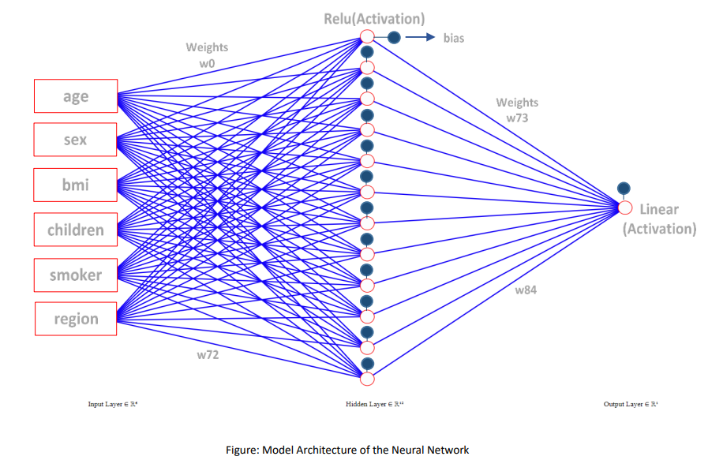
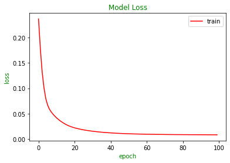
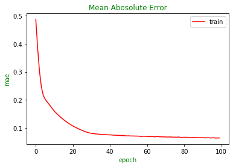

# Medical Cost Prediction Using Neural Network

## Dataset Description 
Dataset used in this network contains information about individual medical costs billed by a health insurance company. It can be found here: https://www.kaggle.com/datasets/mirichoi0218/insurance. The dataset has six input attributes & one output attribute with 1338 instances. Attribute name, type, values are described below:

| Name            | Information                                                        | Type               | Values                                            |
|-----------------|--------------------------------------------------------------------|--------------------|---------------------------------------------------|
|     age         |     Age of primary beneficiary                                     |     Numerical      |     (Continuous)                                  |
|     sex         |     Insurance contractor gender                                    |     Categorical    |     Male, Female                                  |
|     bmi         |     Body Mass Index                                                |     Numerical      |     (Continuous)                                  |
|     children    |     Number of children (dependents) covered by health insurance    |     Categorical    |     0,1,2,3,4,5                                   |
|     smoker      |     Smoker or Non-smoker                                           |     Categorical    |     yes, no                                       |
|     region      |     Beneficiary's residential area in the US                       |     Categorical    |     northeast, southeast, southwest, northwest    |
|     charges     |     Individual medical costs billed by health insurance            |     Numerical      |     (Continuous)                                  |

## Model Architecture
The model architecture for this network is drawn below:

## Parameter/Hyper Parameter Description
I have used one hidden layer for training the model. For input layer, six attributes are taken as input. For hidden layer twelve neurons are used.

Here, No. of Parameters = No. of Inputs * No. of Neurons + No. of Neurons (Bias)

For hidden layer No. of Parameters = 6 * 12 + 12 = 84

For output layer No. of Parameters = 12 * 1 + 1 = 13

So, Total trainable Parameters = 84 + 13 = 97

All the layers are connected densely in this model. For the hidden layer “Rectified Linear Unit (RELU)” activation function is used. The model is compiled using “Mean Squared Error” loss function and “Adam” optimizer with learning rate 0.01. “Mean Absolute Error” is used as performance major metrics. Total 100 Epochs with Batch Size 107 is processed to update the parameters.

## Result
After training the model, loss curve and mae curve are generated as below:

After training, 

For test parameters, loss = 0.54%

For train parameters, loss = 0.58%
